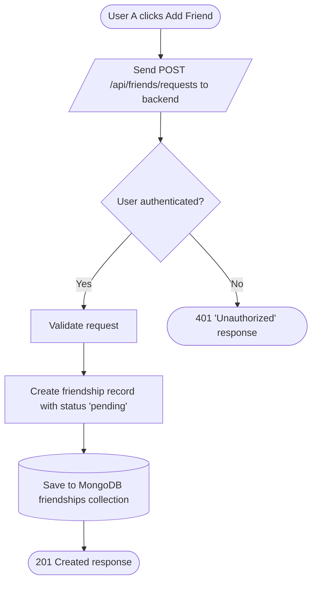
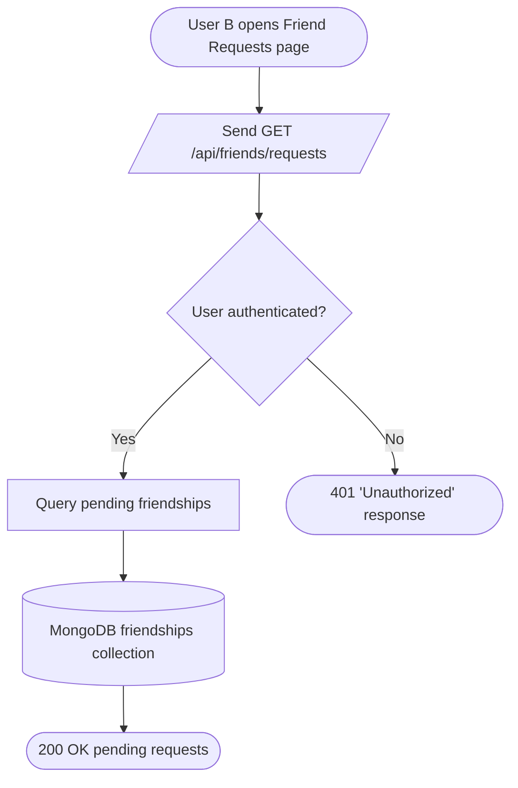
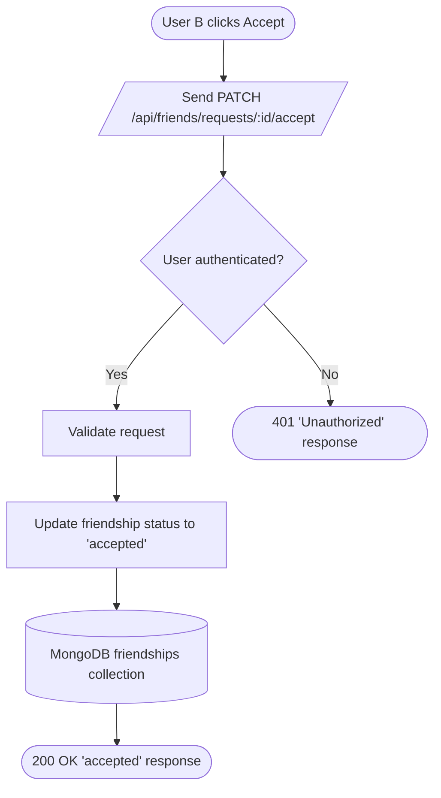

# Friend Request and Accept Process

This document outlines the process for sending and accepting friend requests. It shows that only authenticated users can perform these actions, and that requests are made persistent by being stored in a MongoDB collection as "pending" until accepted. 

## 1. Send Friend Request

## 2. Load Pending Friend Requests

## 3. Accept Friend Request

