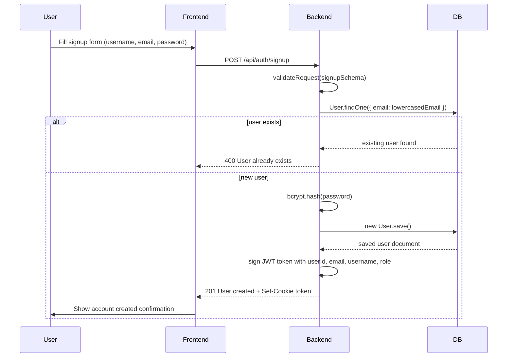
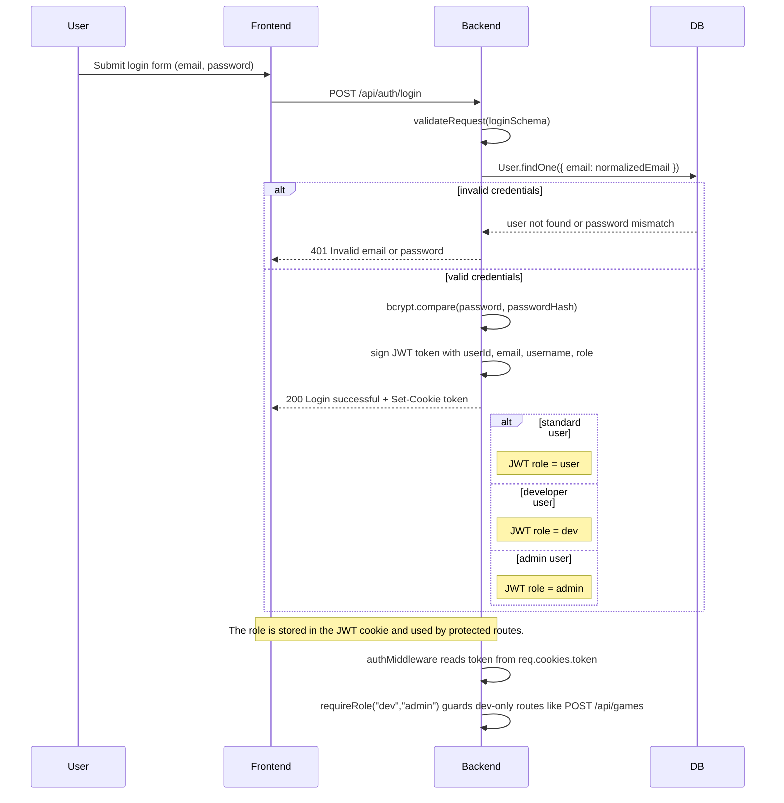
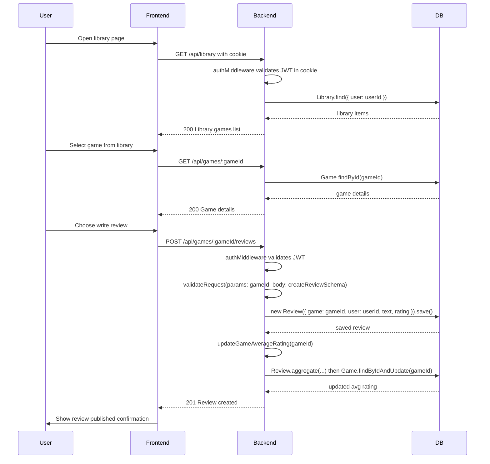

# Sequence Diagrams for Users Data Flows

This file contains Mermaid sequence charts for three key processes in the GameHive project:

1. Registering a new user
2. Authenticating a user logging in (with `user`, `dev`, and `admin` roles)
3. Example case: A user accessing a game in their library and writing a review for that game.

This will demonstrate the application's typical internal interactions, while also highlighting how authentication and role-based access control ensures safe handling of user's data.
---

## 1. Registering a New User

---

## 2. Authenticating a User Logging In

---

## 3. Accessing a Game in Library to Write a Review

---

### Notes

- `POST /api/auth/signup` creates a new user, hashes the password, stores the user, then signs a JWT cookie.
- `POST /api/auth/login` authenticates the user and issues a JWT cookie containing `role`.
- `authMiddleware` reads the token from `req.cookies.token` and sets `req.user`.
- `requireRole("dev","admin")` is used for developer/admin restricted routes such as creating games, moderating reviews and managing user accounts.
- Review creation is protected by `authMiddleware` and uses `POST /api/games/:gameId/reviews`. Only authenticated users can write reviews and only for games in their library. The average rating is updated after each new review.
